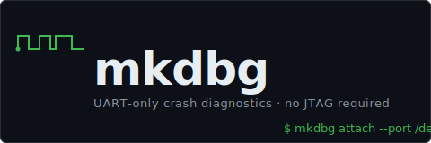

**Crash diagnostics for embedded firmware — over UART, no debug probe needed.**

Your board crashes at 3am. You have a serial cable. That's enough.

```
$ mkdbg attach --port /dev/ttyUSB0

FAULT: HardFault (STKERR — stack overflow)
  PC  0x0800a1f4  task_sensor_run+0x3e
  LR  0x08009e34  vTaskStartScheduler

Backtrace:
  #0  fault_handler
  #1  task_sensor_run     ← likely culprit
  #2  vTaskStartScheduler
```

---

## How it works

mkdbg is two things:

**A firmware agent** (~300 lines of C) that you link into your RTOS. When the MCU faults, it halts and sends crash state over the UART you already use for logging.

**A host CLI** that reads that crash state, decodes registers and the fault status register, and prints a human-readable report — in under a second.

No J-Link. No ST-Link. No OpenOCD. No GDB required for a crash report.

---

## Get started

**1. Install the host tool**

```bash
curl -fsSL https://raw.githubusercontent.com/JialongWang1201/mkdbg/main/scripts/install.sh | sh
```

Or build from source (requires `cmake` and a C compiler):

```bash
git clone --recurse-submodules https://github.com/JialongWang1201/mkdbg
cmake -S mkdbg -B mkdbg/build && cmake --build mkdbg/build
```

**2. Add the firmware agent**

Drop two functions into your HardFault handler and UART HAL:

```c
// in your HardFault_Handler:
wire_on_fault();          // halts CPU, sends crash state over UART

// in your UART driver (send N bytes):
void wire_uart_send(const uint8_t *buf, size_t len) { /* your HAL */ }
void wire_uart_recv(uint8_t *buf, size_t len)       { /* your HAL */ }
```

That's it. See [`docs/PORTING.md`](docs/PORTING.md) for the full guide.
The STM32F446RE reference is at [`examples/stm32f446/`](examples/stm32f446/).

**3. Attach after a crash**

```bash
mkdbg attach --port /dev/ttyUSB0 --arch cortex-m
```

---

## What else it does

| Command | What you get |
|---------|-------------|
| `mkdbg attach` | Crash report: fault type, registers, heuristic backtrace |
| `mkdbg seam analyze capture.cfl` | Causal chain from the fault event ring — *what led to the crash* |
| `mkdbg dashboard` | Terminal UI: live probe status, build age, git state |
| `wire-host --port /dev/ttyUSB0` | TCP↔UART bridge so `arm-none-eabi-gdb` connects without a probe |

---

## Works on any MCU

mkdbg is board-agnostic. The firmware agent is C99 with no OS dependencies — link it into FreeRTOS, Zephyr, bare-metal, anything.

Porting checklist: implement `wire_uart_send` / `wire_uart_recv`, call `wire_on_fault()` from your fault handler. Done.

---

## License

MIT. The `seam` and `wire` submodules are also MIT. libgit2 is MIT.
